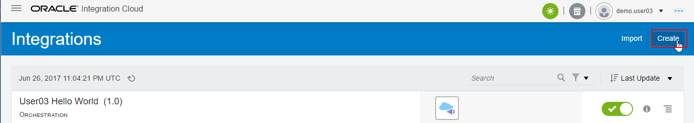

# Lab 300 - Create an OAIC Integration using a Database Adapter

---

## Introduction

This is the third of several labs that are part of the **OAIC Integration Development** workshop. 

In this lab, you develop an integration in OAIC using a database adapter to query an On-Premises Oracle database.

In the previous lab, a REST connection was created.  In a similar manner we need to create the connections necessary for the integration in this lab. We will be creating a Oracle Database connection in addition to the REST connection created previously.

The OAIC integration that we'll be building is shown in the following picture:


Here is a description of what is happening with this integration:

Postman will be used to test the exposed Web Service endpoint of the OAIC integration called *UserXX Connect DB* (where XX will be the Number assigned by the Instructor).  This integration has 2 connections.  The incoming message is received by the incoming *UserXX REST* Rest Connection.  The *UserXX Connect DB* orchestration makes 1 query into the Oracle database using the *UserXX Oracle DB 12c* connection to get details needed to create an order in EBS.  After the database calls are made, the results from the query are returned to the calling web service.

## Objectives

- Learn how to create OAIC REST and Database Adapter Connections
- Learn how to create an OAIC Orchestration using the OAIC Adapters
- Learn how to test the OAIC integration using Postman

## Required Artifacts

- The following lab and an Oracle Public Cloud account that will be supplied by your instructor.
- Postman will need to be installed for OAIC integration testing - see "Prerequisites" section of the workshop for details

## Part 1: Create the OAIC Connections

### Login to the OAIC Service Console

---

- From your browser (Firefox or Chrome recommended) login to the OIC Integration Console using the following URL:

OIC Integration Home Page - https://**OAIC Instance URL**/ic/integration/home/faces/global

**OAIC Home Page URL** provided by your instructor

- Enter your `User Name` and `Password` and click **Sign In** if required

***NOTE:*** the **User Name and Password** values will be given to you by your instructor.

  

- You may be presented with the tutorial overlay for the OAIC Service Console - since we already went through OAIC in Lab 100, dismiss the tutorial by clicking on _Got It!_

	

- You will now be presented with the OIC Integration Service Console from which you will be performing the rest of this workshop lab.

	


### Create the Database Connector

---

- Click on **Create** button again in the upper right

	 

- Select the **Oracle Database** Connection, by either doing a search, or by scrolling down to the **Oracle Database** connection, then click on the **Select** button of the **Oracle Database** connection.

Note: If there is still a filter typed in for the REST adapter, you can clear it by selecting the `X` next to the search box.


- Fill in the information for the new connection:

	- **Name:** Enter in the form of _UserXX Oracle DB 12c_ where XX is the number in your allocated user.
	- **Role:** Select _Invoke_ since we going to call the connection as an invocation from the integration

Note that the **Identifier** will automatically be created based on the **Name** you entered.

- Click **Create**

	 

- Click the **Configure Connectivity** button

_NOTE:_ The "Oracle Database" header will show that the connection is both "Trigger and Invoke" even though it was setup to be a "Invoke" only.  This is a known issue.

 

- Enter the values given to you by your workshop instructor for the *Connection Properties*, then select the _OK_ button:

	- **Host:** - `unit51102.oracleads.com` - this is only an example of an EBS hostname and may not be the EBS instance used in your workshop
	- **Port:** - `1521` - this is the default database port for the EBS database
	- **SID:** - leave this blank, you need either a SID, or a Service Name which we gave, but not both
	- **Service Name:** - `ebssrv` - this is the Service Name for the sample database we will be using

	 

- Next scroll down in the Connection Configuration page and select the **Configure Security** button.

	 

- Enter the following Username and Password for the EBS adapter connection.

The following values are example DB schema username/password and may not be the one used in your workshop.  
Your workshop instructor will tell you if it needs to be changed.

- **Username:** - `ttc_user` 
- **Password:** - _provided by your instructor_ 

- Click on the **OK** button to save the credentials.

	

- Now, scroll down again in the Connection Configuration page and select the **Configure Agents** button.

	

- Select the *ON_PREM_AGENT_GROUP* which should be the only entry in the agent list by clicking the name, then select the **Use** button.

	

- At the top of the connection configuration screen, Click on the **Test** button to test the connection.

	

Note how the progress indicator will go from 85% to 100% after the connection tests successfully.

 

- Click on the **Save** button in the upper right corner of the connection configuration screen.

	 

- Click on the **Close** button in the upper right of the connection configuration screen.

	

Your new Database connection appears in the list of configured connections and is even marked as **New** !

**Note** how the icon for the connection is different between the REST and Database connector.

 

## Part 2: Create the OAIC Integration

---

### Create Orchestration Integration

- On the upper left-hand navigation of the Connections screen select the _Hamburger_ menu, then the *Integrations* link

	

- Click on the _Hamburger_ menu icon again to dismiss the left-hand navigation.

- Select the **Create** button in the upper-right of the Integrations screen

	

- In the **Create Integration - Select a Style**, select the **App Driven Orchestration** style.  

	

- Fill in the information for the new orchestration

	- **What do you want to call your integration?:** Enter the name in the form of _UserXX Connect DB_ where XX is the number in your allocated user.
	- **Identifier:** Accept the default - this value will be generated based on the name you enter.
	- **Version:** Accept the default - if you want to clone and create newer versions later, you can change to a higher version than **01.00.0000** which is the default.

After you've filled in the information, select the **Create** button


- Observe the design canvas for the new integration.  (The various features of the OAIC designer were covered in lab 100 **Exploring OAIC** earlier in this workshop)

	

- Create the Trigger for the orchestration. This integration will have a REST endpoint as defined when we created the **UserXX REST** connector earlier.

Expand the list of REST Triggers by clicking on the **REST(X)** link (where `X` will be the number of REST connections in the OAIC instance - this will vary depending on how many others are running the workshop together).

Click and drag your REST connection identified by your assigned user (ie: `UserXX REST`) over to the **Start** target.  

(Note: After you click and start dragging your connection, the `Triggers` connection tray on the left hand side of the designer will become hidden)


- Drop your connection onto the large *Plus Sign* inside the *Start* circle.

	

- Give your trigger a name in the *Configure REST Endpoint -> Basic Info* dialog.

	- **What do you want to call your endpoint?** _GetItems_
	- **What is the endpoint's relative resource URI** _/items_
	- **What action does the endpoint perform?** _GET_
	- **Configure for this endpoint to receive a response** _Checked_

After filling in the name, click on the **Next >** button


- Select **JSON Sample**, select **JSON** in *type of payload* and click on **<<< inline >>>** to enter sample JSON

	

- Enter the following JSON into the **Enter Sample JSON**, click **Ok**, then **Next >**
```javascript
[{
"ItemID":"abcsd",
"Item":"xyz",
"Price":"fnfds",
"Item_Description":"xysahjkj",
"Category":"xs:string",
"UOM":"xs:string"
},
{
"ItemID":"abcsd",
"Item":"xyz",
"Price":"fnfds",
"Item_Description":"xysahjkj",
"Category":"xs:string",
"UOM":"xs:string"
}]
```


- Back on the Response Page,  click **Next >** to get to the Summary page.

	

- Click **Done**. The full flow will now be presented:

	

- Save the progress of your orchestration by clicking on the **Save** icon in the upper right of the design window

	

### Create an Invocation using the Database Connection

- Open the **Invokes** connection tray by clicking on the `Invokes` link in the very right of the orchestration design pallette so we can create the first call to the database.

	

- Select your database connector by clicking on the **Oracle Database(X)** link. (where `X` will be the number of Database connections in the OAIC instance - this will vary depending on how many others are running the workshop together).
Click and drag your Database connection identified by your assigned user (ie: `UserXX Oracle DB 12c`) over to the target which will be just below the `GetItems` trigger.

(Note: After you click and start dragging your connection, the `INVOKES` connection tray on the left hand side of the designer will become hidden)


- Drop your connection onto the large *Plus Sign* just below the `GetItems` trigger.

	

- Fill in the information for the new invoke in the *Oracle Adapter Endpoint Configuration Wizard* dialog.

	- **What do you want to call your endpoint?:** Enter the name `GetProducts` as the service invocation name.
	- **What operation do you want to perform?:** Select `Run a SQL Statement`.  The database adapter supports both calling database stored procedures as well as running ad-hoc SQL statements.

After filling in the basic information, click on the **Next >** button


- Copy the SQL statement provided inline here:

`select msi.inventory_item_id "ItemID", msi.segment1 "Item", msi.LIST_PRICE_PER_UNIT "Price", msi.description "Item Description", mc.segment1 "Category", msi.primary_uom_code "UOM" from inv.mtl_system_items_b msi, inv.mtl_item_categories mic, inv.mtl_categories_b mc, inv.mtl_category_sets_b mcs, inv.mtl_category_sets_tl mcs_tl, inv.mtl_default_category_sets mdcs, inv.mtl_parameters mp where msi.organization_id = mp.organization_id and mcs.category_set_id = mcs_tl.category_set_id and mcs_tl.language = 'US' and mic.inventory_item_id = msi.inventory_item_id and mic.organization_id = msi.organization_id and mic.category_id = mc.category_id and mic.category_set_id = mcs.category_set_id and mcs.category_set_id = mdcs.category_set_id and mdcs.functional_area_id = 1 and mp.ORGANIZATION_ID=204 and msi.CUSTOMER_ORDER_ENABLED_FLAG = 'Y' and msi.description like '%Delux%'`

Note: The SQL query has to be in one line and doesn't end with a semi-colon.

- You can also download a SQL file using the link below:
	https://oraclecps.github.io/oichybridintegration/artifacts/GetProducts.sql


Click on the **Validate SQL Query** button so the query can be validated for proper SQL syntax.

 

- Verify that the SQL query was validated by the `Success!` message that will appear in the **Status** on the *Enter a SQL Query* dialog page.

If the query won't validate, then ensure you didn't paste in any funny characters or extra lines for the query.

Select the **Next >** button after you've validated the query has been successfully validated.


- Review the settings for your new adapter configuration in the *Oracle Adapter Endpoint Configuration Summary* dialog.

After reviewing, click on the **Done** button


- Observe that the orchestration's design pallette is populated with the invoke _GetProducts_ you just created along with the mapping needed to invoke this adapter.

Click on the **Zoom to Fit** button in the upper right of the design pallette if you want to see the entire orchestration.


- Click on the *mapping symbol* for the _GetProducts_ mapping - this will bring up 3 icons for activities we can do to the mapping.  

Click on the `pencil icon` to edit the mapping.

Note: You can also view the mapping by clicking on the `eye` icon.  In the `hamburger` icon, you can either upload an external XSLT file for this mapping that you've created external to OAIC, or you can delete the mapping.


- Edit the mapping by clicking on the little circle to the right of the `execute` source variable and then clicking on top of the little circle just to the left of the `GetProductsInput` target variable. Finally, click on the Map button to create the mapping. 

Note: As described in the lab 100 OAIC overview, this map could be tested by selecting the **Test** button in the upper right.  We aren't going to test this mapping because it is so simple.

After completing the mapping, save it by clicking on the **Validate** icon in the upper right of the design window


- Exit the mapping editor by clicking on the **Close** button in the upper left.

	

- Save the progress of your orchestration by clicking on the **Save** icon in the upper right of the design window

	

### Create the Return Payload for the Integration

- Click on the *mapping symbol* for the _GetItems_ return payload mapping.  

Click on the `pencil icon` to edit the mapping.


- Map the values `GetProductsOutput` to the corresponding values in `topLevelArray`

	- In the Source variable section, click on the chevron to the left of the `GetProductsOutput` variable to expand it.
	- Click on the little circle to the right of the `GetProductsOutput` source variable and then click the little circle just to the left of the `topLevelArray` target variable. Finally, click on Map button to create the mapping. 
	- Similarly, map each item under `GetProductsOutput` to the corresponding value under `topLevelArray`.  

- The return payload mapping is now complete.

	- Select the **Validate** button in the upper right of the mapping editor.
	- After validating, select the **Close** button also in the upper right

	

The final step in creating this integration is to add tracking variables.

### Add Tracking Variables for the Integration

-	Open the “Tracking” editor

- Click on the _Hamburger_ icon, the click on the `Tracking` menu item to bring up the business identifier editor.

	

-	The `Business Identifiers For Tracking` editor will be opened up

- Click on the *execute* variable in the Source variable section.  The editor will show the metadata for this variable such as type, path, etc.

- Next, click on the `Shuttle Icon` to move the *execute* variable over to be a new `Tracking Field`.

- Observe that the *execute* variable has now been added as a `Tracking Field`.  The source variable name is also added as the `Tracking Name` by default.

- Select the `Save` button now that the new `Business Identifier` has been added.

	

- Once again, click on the `Save` button to save the tracking changes, then select the `Close` button

	

This integration is now complete.  We now need to activate (deploy) it so it can be used.

### Activate the Integration

- Click on the *Activate* switch/slider on the right of the `UserXX Connect DB` integration.

	

- The `Activate Integration?` dialog will be displayed

- Select the *Enable tracing*, then *Include payload* checkboxes since this isn’t a production deployment.  These checkboxs will tell OAIC that the payloads for each instance of the integration will be saved in the logfiles as explored in the first part of this lab earlier.

- Now select the *Activate* button to begin activation of the integration.

	

- The progress bar of the integration activation will move across the `Activate Integration?` dialog box.

- Once the integration is activated you will see that the activation slider now is colored green with a checkmark in it.

	

### Check the Service Endpoint

- A message will appear on the top of the OAIC Designer Portal indicating that the integration activation was successful.  The link for the service endpoint will also be displayed.

- Click on the link so we can ensure that this integration has an available service endpoint.

	

- The Endpoint Description for you new OAIC integration will now be displayed in your browser.

- Copy the Endpoint URL into your copy buffer so we can test it in the next lab section.

   

- Now that we have built and activated an integration and copied it's service endpoint, we can test it to make sure it works.

## Part 3: Test the OAIC Integration

---

### Test Using Postman

- Open Postman.  If you don't already have this installed, follow the instructions provided in the **Prerequisites** section of this workshop.

	

- In your Workspace, a new tab should open. If not, Click on the **New** button so we can create a new GET request for testing our new OAIC REST Web Service.  


- In the **New Tab** dialog window, paste the Endpoint URL into the **GET** window. 

- Click on the Authorization tab.

- Change the Authorization settings as follow:

	- **Type**     _Basic Auth_

	- **Username** _demo.userXX_

	- **Password** _YOURPASSWORD FOR OAIC_


- Click on the blue **Send**.


	

- Look at the bottom to see the output, the Body should contain an array of the items as fetched by the SQL query, and the Status should indicate a **200 OK**.

	

You have now completed Lab 300 of the OAIC Developer Workshop.