# Lab 500: Create Approval Workflow to process orders"

---

## Introduction

This is the fifth of several labs that are part of the **Oracle Autonomous Integration Cloud (AIC) Hybrid Integration Development** workshop. 

In this Lab we are going to use AIC Process Automation capability to implement a Business Process that will be triggered when an order in submited."

The Approval Workflow that we'll be building is shown in the following picture:


## Objectives

- Create Process Application  
- Test the process

## Create Application
*UserXX* will create the process flow that will require have one approval level and after the approver approves the order it will make external service call to create order into EBS. 
SoapUI will be used to test and trigger the process created by *UserXX*. After the process is triggered we will go to AIC homepage "My Task" tab to approve the process.

### **STEP 1**: Create New Application

- If you are logged out of Oracle Integration Cloud Service **Login** to OIC using the URL provided by the intructor.The URL should be as shown below.
**https://example.oraclecloud.com/ic/home/**

- Start **Process Cloud** and click on **Process Builder**.

        

- In the resulting **Process Builder** navigation pane, click **Applications**.

     

- In the **Application** tab, click **Create** on the top-left corner then click **New Application**.

- Pop-up will open as shown below.

	 

- Enter the **Name** of application as `UserXX_OrderApproval`(where `XX` should be your number assigned to you), then click **Create** as shown.

	

- You should be able to see *Application Home* as shown below.

	

### **STEP 2**: Create Business Objects

- From the left navigation pane click **Business Types**.

	

- Create `Customer` business objects click on **Create** button on right corner then click, **New Business Object**.

	

- Enter the **Name** of Business Object as `Customer` then click on the **+** icon next to Parent Module.

	

- Enter **Name** of new Module as `OrderDetails` then click **OK**.

	

- Now, click **Next**

- Click on the **+** icon

- Enter Attribute **Name** as `customerId` then click **Add**

	

- Click on the **+** icon and add another attribute `customerName` by repeating above two steps, then click **Finish** button as shown below.

	

- Create `Item` business objects again click on **Create** button on right corner then click, **New Business Object**.

	

- Enter the **Name** of Business Object as `Item` then make sure the **Parent Module** is `OrderDetails` then, click **Next**

	

- Click on the **+** icon and add all the attribute mentioned in the table below, then click **Finish** button as shown below. Make sure the data type is `String` for all the attribute.

	

	<table border=2, border-width=2>
	  <tr>
	    <th  style="background-color: #008000">Attribute Name</th>
	    <th  style="background-color: #008000">Data Type</th>
	  </tr>
	  <tr><td>itemID</td><td>string</td></tr>
	  <tr><td>item</td><td>string</td></tr>
	  <tr><td>price</td><td>string</td></tr>
	  <tr><td>itemDescription</td><td>string</td></tr>
	  <tr><td>category</td><td>string</td></tr>
	  <tr><td>quantity</td><td>string</td></tr>
	  <tr><td>uom</td><td>string</td></tr>
	</table>

- Create `Items` business objects again click on **Create** button on right corner then click, **New Business Object**.
Note: This is an array that will hold `Item` object we created earlier.

	

- Enter the **Name** of Business Object as `Items` then make sure the **Parent Module** is `OrderDetails` then, click **Next**

	

- Click on the **+** icon and add attribute pop-up will show-up, now 

- Enter **Name** `items` and in **Data Type**  click **Change Type**.

	

- In Type Selector click on **drop-down arrow** and expand Components and choose **OrderDetails.Item** 

	

- Check `Is a list` checkbox and click **OK**

	

- Verify the details and click **Add**

	

- Click **Finish** to close the pop-up.

- Now we will create our master Business Object `Order` business objects again click on **Create** button on right corner then click, **New Business Object**.
Note: This object will hold `Items` and `Customer` along with two other paramater `totalOrderPrice` and `orderTypeid` object we created earlier.

	

- Enter the **Name** of Business Object as `Order` then make sure the **Parent Module** is `OrderDetails` then, click **Next**

	

- Now we will add `Customer` business object we created earlier into the `Order` to do so click on the **+** icon and add attribute pop-up will show-up, now 

- Enter **Name** `items` and in **Data Type**  click **Change Type**.

	

- In Type Selector click on **drop-down arrow** and expand Components and choose **OrderDetails.Item** 

	

- Check `Is a list` checkbox and click **OK**

	

- Verify the details and click **Add**

	

- Now we will add `Customer` business object we created earlier into the `Order` to do so again click on the **+** icon and add attribute pop-up will show-up, now 

- Enter **Name** `customer` and in **Data Type**  click **Change Type**.

	

- In Type Selector click on **drop-down arrow** and expand Components and choose **OrderDetails.Customer** 

	

- Check `Is a list` checkbox and click **OK**

	

- Verify the details and click **Add**

	

- Now we will add two more attribute to do so click on the **+** icon and add attribute pop-up will show-up.

- Enter **Name** `orderTypeid` and keep **Data Type** as String and click **Add**.

	

- Again click on the **+** icon and add attribute pop-up will show-up.

- Enter **Name** `totalOrderPrice` and keep **Data Type** as String and click **Add**.

	

- Verify the details of `Order` business object and click **Finish**.

	

- Click on **Save** button at the top right corner to save all your work.

### **STEP 3**: Create Web Form

- From the left navigation pane click **Forms**.

	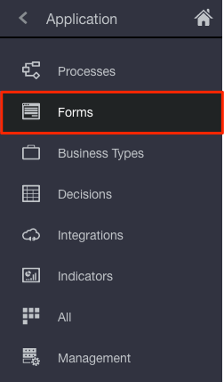

- To start creating Web Form click on **Create** button on right corner then enter the name of Web form as `OrderDetailsForm` and click **Create**.

	

- Now let us first add the master business object we create in step 2 so that we could bind business object to form fields.

- Click on **+** icon on down left corner in `Data` Section.

	

- **Name** the attribute as `order` select **Type** as Business and from drop-down menu select `OrderDetails.Order`.

	

- Verify details and click **Create**

	

- Now from left hand panel `Basic Palette` section select **Input text** and Drag and Drop in form creation canvas as shown below.

	

- Click on the newly created form field then on Properties section >> General tab add **Name** as `customerId`, Label as `Customer ID`and **Binding** as `order.customer.customerId`.

	

- Scroll down and check disabled to avoid approver change and order details.

	

- Similarly add following form fields. Remember all are `Input text`.

	<table border=2, border-width=2>
	  <tr>
	    <th  style="background-color: #008000">Name</th>
	    <th  style="background-color: #008000">Label</th>
	    <th  style="background-color: #008000">Binding</th>
	  </tr>
	  <tr><td>customerName</td><td>Customer Name</td><td>order.customer.customerName</td></tr>
	  <tr><td>totalOrderPrice</td><td>Total Order Price</td><td>order.totalOrderPrice</td></tr>
	  <tr><td>orderTypeid</td><td>Order Type ID</td><td>order.orderTypeid</td></tr>
	</table>

- Your Web form should be as shown below.

	

- Now we will add **table** field from Advanced Palette to accomodate multiple Order Items.

- Drag and Drop **table** from **Advanced Palette** section into the the form canvas after `Order Type ID` as shown.

	

- Click on newly created **table** then on Properties section >> General tab add **Label** as `Order Items` and **Bindings** as `order.items`

- To add column to the table go to Properties section >> General tab >> Columns replace `column` with `ItemID` then click on **+** icon.

	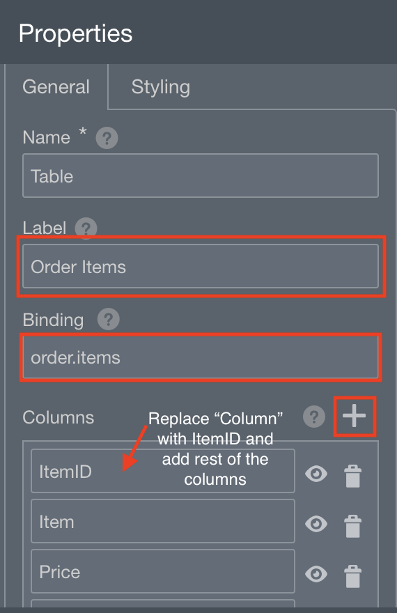

- Similarly add the following columns.

	<table border=2, border-width=2>
	  <tr>
	    <th  style="background-color: #008000">Column Name</th>
	  </tr>
	  <tr><td>Item</td></tr>
	  <tr><td>Price</td></tr>
	  <tr><td>Item Description</td></tr>
	  <tr><td>Category</td></tr>
	  <tr><td>Quantity</td></tr>
	  <tr><td>UOM</td></tr>
	</table>

	

- Scroll down in Properties section and make sure **Disabled** and **Hide Labels** are checked.

	

- Now let us add field to each columns in the table.

- From Basic Palette section on left hand side drag and drop **Input text** right below **ItemID** column in the table as shown below.

	

- Click on newly drag field as shown below.

	

- Now in Properties Section >> General tab update **Label** to `Item ID` and **Binding** to `itemID`.

- Similarly add following field to each columns in the table.

	<table border=2, border-width=2>
	  <tr>
	    <th  style="background-color: #008000">Column Name</th>
	    <th  style="background-color: #008000">Label</th>
	    <th  style="background-color: #008000">Binding</th>
	  </tr>
	  <tr><td>Item</td><td>Item</td><td>item</td></tr>
	  <tr><td>Item Description</td><td>Item Description</td><td>itemDescription</td></tr>
	  <tr><td>Category</td><td>Category</td><td>category</td></tr>
	  <tr><td>Quantity</td><td>Quantity</td><td>quantity</td></tr>
	  <tr><td>UOM</td><td>UOM</td><td>uom</td></tr>
	</table>

- The final Web form should be as shown below.

	


- Click on **Save** button at the top right corner to save all your work.

### **STEP 4**: Create connector to Integration

- From the left navigation pane click **Integration**.

	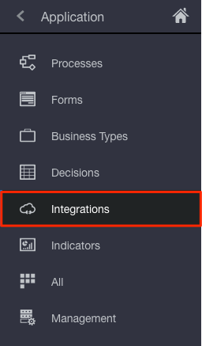

- Click on **Browse Integration** then select the integration you created in lab 400 and click **Create**

	

- Click on **Save** button at the top right corner to save all your work.

### **STEP 5**: Create Process Flow

- From the left navigation pane click **Processes**.

	

- To start creating Process under **Create a Process** click on **Start when a message is received**.

	

- Enter the **Name** of the process as `OrderApprovalProcess_UserXX`. 

- Optionally write the **Description** `This process will have one level approval mechanism`.

- In **Select a Pattern** choose **Message** and click **Create**.

	

- Since this process require one level approval we will add one more swimlane, to do so click in the **+** icon at the center of the screen.

	

- Rename the swimlane by double clicking on **Process Owner** and enter `Process Reviewer`.

- Optionally rename the first swimlane with `Process Owner`.

	

- Drag **End** message icon little far from **Start** icon.

- Now Click at the center of the line between **Start** and **End** message icon and drag to `Process Reviewer` swimlane at time point your process flow should be as shown below.

	

- Now Let us add `Approve` human task to do so from right navigation expand **Human** task then select **Approve** and drag it in `Process Reviewer` swimlane your process flow should be as shown below.

- Rename the newly create human task by double clicking on **User task** and enter `Approve Request`.

	

- Now we will add exclusive Gateway to evaluate the outcome of **Approve Request** human task created in earlier step.

- From right hand navigation expand **Gateways** then drag and drop **Exclusive** gateway after the **Approve Request** task.

- Rename the newly created gateway by double clicking on **Exclusive gateway** and enter `Approved?`.

	


- Now click on `Approved?` gateway then drag the arrow icon and drop on **End** as shown below.

	

- Now we will add System task to call our Integration flow which will create Order inside EBS application.

- From right hand navigation expand **System** then drag and drop **Service** task after the **Approve?** gateway as shown below.

	

- Rearrange the flow as shown below.

	

### **STEP 6**: Configure Process Flow

## Configure Properties

- Click on the **Start** message icon then click on hamburger menu and select **Open Properties** a window will slide-up from bottom.

	

- In **Type** Click on the pencil icon as below.

	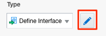

- Keep **Operation Name** as `start`. 

- Click on **+** icon to add Arguments Definition.

	- **Name**: `customerId`
	- **Type**: `string`

- Similarly add the following Arguments.

	<table border=2, border-width=2>
	  <tr>
	    <th  style="background-color: #008000">Name</th>
	    <th  style="background-color: #008000">Type</th>
	  </tr>
	  <tr><td>customerName</td><td>string</td></tr>
	  <tr><td>orderTypeID</td><td>string</td></tr>
	  <tr><td>totalOrderPrice</td><td>string</td></tr>
	  <tr><td>items</td><td>OrderDetails.Items [Note: this is inside components]</td></tr>
	</table>

	

- Click **OK** to close the pop-up.

- Now, Click on the **Approve Request** human task then click on hamburger menu and select **Open Properties** a window will slide-up from bottom.

- Under **Assignee(s)** click on the pencil icon next to input box as shown below.

	

- For **Build a list of participants using:** select **Names and Expressions** from drop-down.

	

- Click on **+** icon and then select **Add User** from the drop-down menu as shown below.

	

- In the **Value** column click on the **magnifying glass** icon.

- Now, click on text input field and choose **FirstName**

- Enter your username and click **search**
	- Username: USERXX

- The table will be filled with your user details. Click on the checkbox below **ID** column and click **OK**.

	

- Under **How to display the task information?** >> Form click on maginifying glass icon as shown below.

	

- Select **OrderDetailsForm** from the pop-up.

	

- Now, Click on the line between **Approve?** and **End**then click on pencil icon.

- Enter the name as `No` then click on pencil icon next to **Condition** input box.

	

- In expression editor enter `TaskOutcomeDataObject == "REJECT"` and click validate.

	

- Click **OK** to close the pop-up. 

- Click on the line between **Approve?** and **Service**then click on pencil icon.

- Enter the name as `Yes`.

	

- Now, Click on **Service** task then under **How do you want to implement it?** >> Type click on **Not Implemented** then select **Service Call**.

- Now Click on pencil icon next to **Service Call**

- In Configure pop-up select **Type** as **Integration** then click on magnifying glass.

	

- Select the Integration connector you added in **Step 4** and click "OK".

	

## Configure Data Association

- Click on the **Start** message icon then click on hamburger menu and select **Open Data Association** a window will slide-up from left .

	

- From right pane expand **items** and from left pane expand **OrderApprovalProcessUserXX**>> **Data Object** >> **orderDetailsFormDataObject** >> **order** >> **customer**

- Drag and drop **customerId** from left pane below **Start** and **customerId** from right pane below **OrderApprovalProcess_UserXX** as shown below.

	

- Similarly map all the elements as shown below.

	<table border=2, border-width=2>
	  <tr>
	    <th  style="background-color: #008000">Left Pane</th>
	    <th  style="background-color: #008000">Right Pane</th>
	  </tr>
	  <tr><td>customerName</td><td>orderDetailsFormDataObject.order.customer.customerName</td></tr>
	  <tr><td>orderTypeID</td><td>orderDetailsFormDataObject.order.orderTypeid</td></tr>
	  <tr><td>totalOrderPrice</td><td>orderDetailsFormDataObject.order.totalOrderPrice</td></tr>
	  <tr><td>items.items</td><td>orderDetailsFormDataObject.order.items</td></tr>
	</table>

	

- Click **Apply** on top right corner.

- Click on the **Service** task icon then click on hamburger menu and select **Open Data Association** a window will slide-up from left .

	

- From left pane expand **OrderApprovalProcessUserXX** >> **Data Object** >> **orderDetailsFormDataObject** >> **order** >> **customer**

- From right pane expand **createOrderRequest** >> **header** and **lines**

- Drag and drop **customerId** from left pane below **OrderApprovalProcess_UserXX** and **accountID** from right pane below **Service** as shown below.

	

- Similarly map all the elements as shown below.

	<table border=2, border-width=2>
	  <tr>
	    <th  style="background-color: #008000">Left Pane</th>
	    <th  style="background-color: #008000">Right Pane</th>
	  </tr>
	  <tr><td>orderDetailsFormDataObject.order.customer.customerName</td><td>createOrderRequest.header.accountName</td></tr>
	  <tr><td>orderDetailsFormDataObject.order.orderTypeid</td><td>createOrderRequest.header.orderTypeID</td></tr>
	</table>

	

- Now Drag and Drop **items** from left pane below **orderDetailsFormDataObject.order.orderTypeid** and **linesArray** from right pane below **createOrderRequest.header.orderTypeID**

	

- Notice you have an error in **items** and **linesArray** mapping, to resolve it click on  then click **Transform**.

- A pop-up will open click on **Create** button to create new transformation.

	

- Enter the **Name** of transformation as `itemsTolinesArray` and click **Create**.

	

- Map all the elements by dragging and dropping in corresponding boxes as shown below.

	

- Click **Save** on top right corner next to **Cancel**.

- Now click on **Output** tab on top as shown below.

	

- From right pane expand **createOrderResponse** and from left pane expand **OrderApprovalProcessUserXX**>> **Data Object**

- Drag and drop **status** from left pane below **Service** and **TaskOutcomeDataObject** from right pane below **OrderApprovalProcess_UserXX** as shown below.

	

- Click **Apply** on top right corner.

- Click on the hamburger menu **** at top right corner and then click on **Validate Application**.

	

- If your application is configured correctly you will see below message.

	

- Click on **Save** button at the top right corner to save all your work.

### **STEP 7**: Publish, Activate and Test Process

### Publish

- Click on **Publish** button at top right give comments as `Version 1.0` and click **Publish**

	


## Activate

- Click on **Activate** button at top right and click **Activate new Version**

- Select **Last Published Version** click **Validate**

- Click **Options** and enter **Revision id** as `1.0` then click **Activate**

	

- Click **Finish** to close the pop-up.


- You will see the recently activated process as below.

	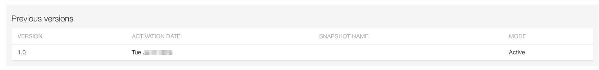

## Test

- Click on the **Management** tab on left navigation pane

	

- Click on the hamburger icon in **Action** make sure it is of the application `UserXX_OrderApproval` and click on Web Service

	

- Copy the url displayed in **Exposed** tab into notepad or your text editor and **close** the dialog box by clicking on **X**.

	

- Open SoapUI.  If you don't already have this installed, follow the instructions provided in the **Prerequisites** section of this workshop.

	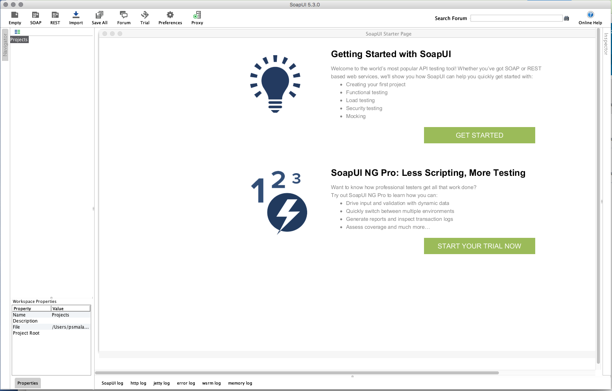

- Click on the **SOAP** button so we can create a new project for testing our new ICS SOAP Web Service

	

- In the **New SOAP Project** dialog window, paste the WSDL URL into the **Initial WSDL** window and give a meaningful **Project Name** such as `UserXX_PCS_OrderApproval`.  Keep the checkbox selected for **create sample requests for all operations?**.  Click on the **OK** button after you've initialized the settings for your new SoapUI SOAP project.

	

- The new SOAP Project will appear in the left-hand navigation.

- Expand the **OrderApprovalProcessUserXXBinding** >> **start** operation by clicking on it, then open the auto-generated sample request **Request 1** by double-clicking on it.  An empty request payload will be generated.

	

- In the request payload, as in earlier labs, replace the question marks with the following test values:

	- **customerId**: _1002_
	- **customerName**: _Imaging Innovations, Inc._
	- **orderTypeID**: _1430_
	- **totalOrderPrice**: _1000_
	- **itemID**: _2155_
	- **item**: _AS18947_
	- **price**: _1208_
	- **itemDescription**: _Sentinel Deluxe Desktop_
	- **Category**: _COMPUTER_
	- **Qty**: _1_
	- **UOM**: _Ea_


	

- Next we need to add the authorization credentials so ICS will allow the request from SoapUI.  ICS uses basic username/password authentication.

- Click on the **Auth** button in the lower-left of the **Request 1** SoapUI window

- In the **Authorization** dropdown, select _Add New Authorization..._

	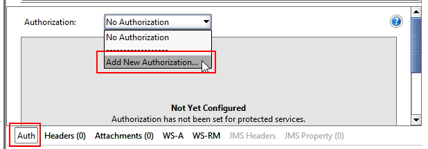

- In the **Add Authorization** dialog pop-up window, select **Type** of _Basic_ form the picklist, then select the **OK** button.

	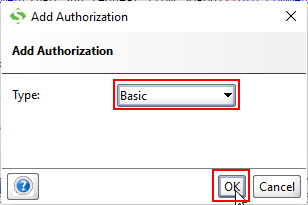

- Fill in your assigned username and password in the **Auth (Basic)** window at the bottom of the SoapUI request window

	

- ICS needs two headers in the request payload to satisfy the enforced Web Services Security (WSS) standards.  It needs both the **WSS Username Token** and the **WS-Timestamp**.

- Insert the **WSS Username Token** by right-clicking in the Request payload body and select **Add WSS Username Token** from the pull-down list

	

- In the **Specify Password Type** dialog pop-up window, select _PasswordText_ as the WSS Username Token type, then click on the **OK** button.

	

- Insert the **WS-Timestamp** by right-clicking in the Request payload body and select **Add WS-Timestamp** from the pull-down list

	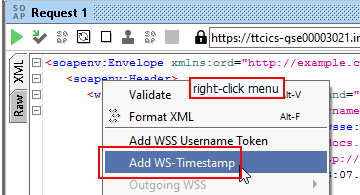

- In the **Specify Time-To-Live value** dialog pop-up window, set the value (in milliseconds) to _60000_ (60 seconds), then click on the **OK** button.

	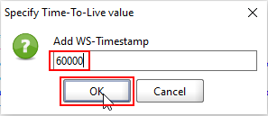

- Finally your request payload is ready to send to ICS.

- Click on **Raw** tab from right pane.

- Click on the green _Submit Request_ arrow in the upper left of the **Request 1** window.

	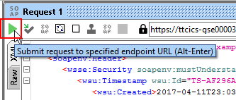

- If the Process is triggered you will see below screen with `202 Accepted`

	

### **STEP 8**: Verify Process is triggered

-  Go back to Integration cloud application web page and click on **home** icon at the top of left navigation.

- Click on **My Tasks** from left navigation menu.

- You should be able to see the task of the process you created as shown below.

	

- Click on the task then verify the details and click **Approve** on top right corner to Approve the task.

	

- You will see message **Performed approve action on the task**.


```
You have now completed Lab 500 of the AIC Developer Workshop. In the next lab, we will use AIC ABCS to build a UI and invoke process orders web service.

- This Lab is now completed.


