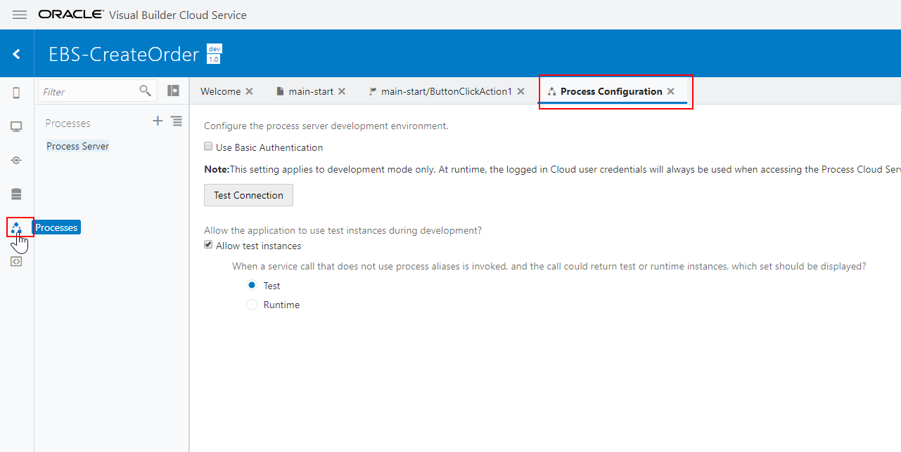
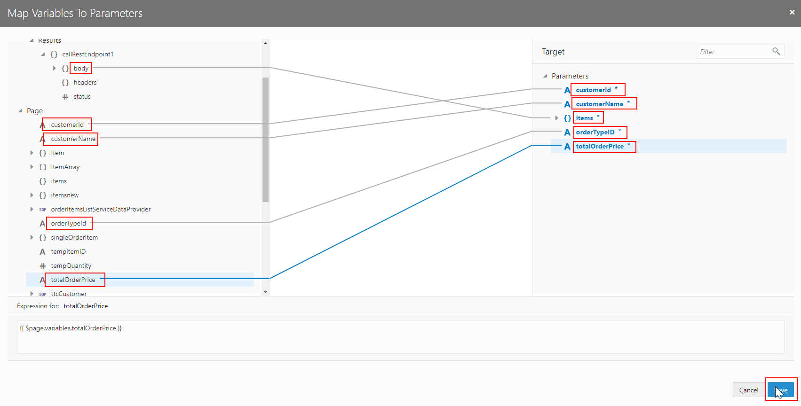
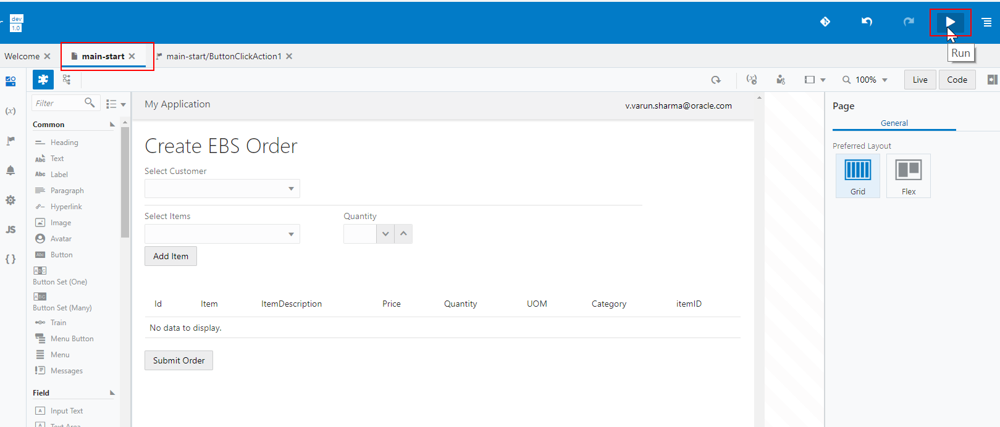

# Lab 600: Add ABCS Screen to Trigger Process Order Web Service

## Introduction

In this Lab we are going to use AIC ABCS to create a UI, then call Process Orders Web Service..

In the previous lab, we created a Process to approve/reject orders. In this lab, we are going to build a Graphical User Interface to create an order and call the Process Orders web service. 

## Objectives

- Import a web application in Visual Builder Cloud Service
- Learn how add Process in the web application.
- Invoke the Process Orders Web Service from our custom web application.

## Required Artifacts

- The following lab and an Oracle Public Cloud account that will be supplied by your instructor.

## Login to your Oracle Cloud account

### Login to OIC Integration Home Page

>***NOTE:*** the **User Name** and **Password** values will be given to you by your instructor. See _Lab 100 : Login to your Oracle Cloud Account_ for more information on how to sign into the ICS home page

- Select **Visual Builder** to open up the Visual Builder Console from which you can start performing the rest of this workshop lab. 

	

### Import the Visual Application

- Click on `Import` in the upper-right corner of the console to import a Visual application.

	

- In the Import Dialog box, click on **Application from file**

	

- Upload the zip file for the visual application provided by your instructor, and fill in the information to import the application. 
	- **Applicaton Name:** Enter in the form of _UserXX EBS-CreateOrder_ where XX is the number in your allocated user.

	

- The application should have been imported and displayed in the applications. Click on the application to open it. 

	

### Modify the application inputs to invoke the Process Orders Web Service

## Open the application

- The application home page should be opened now. You should be able to see the home screen and the different options within the application. Go ahead and click on **Web Applications** on the left-hand side menu. 

(Note: There are several options on the left-hand side such as Mobile applications, Web applications, Service Connections etc. Feel free to explore them)


- The Web Apps section should open. Expand the applicaton - `ebs_createorder` in this instance - and click on **main-start**. It should open a main-start page in the right panel next to the Welcome page. This is your main application. Observe the design canvas for the web application.

	 

Now, before we run the application we need to configure a couple of things such as configure the process and set the input variables. 

## Configure the Process created in previous lab

- Click on **Processes** in the left panel. It should open the Process Configuration page. You can test the connection with the Process Cloud here by clicking the Test Connection button. 

	 

- Click on the _Plus Sign_ next to Processes to Register a Deployed Process. 

	

- It should open a Register Deployed Process dialog box. Select the **Process Name** that you just created in _Lab 5_. Then click on the **Add** button to add an Alias. Finally, click on **Close**. 

	

- The form should have been added under Process Server. Click on it to open it in a new Page to display it's Properties. 

	

## Assign input parameters to the Process 

Now that the Process has been created, we need to assign the input parameters to the Process in the application. 

- Click on the **main-start** in the right panel to open up the main-start page. Click on **Submit Order** button to display it's properties. 

(Note - If you don't see the Properties, click on the _Collapse Property Inspector_ to toggle the properties pane. )

	


- In the Properties, click on Events to display the action events associated with the button. Click on **ButtonClickAction1** action. 

	

- It should open a new page window for the buttonClickAction event. Observe that it contains a Start Process icon in the action-chain. Click on the **Start Process** icon.

	

- In the Start Process Properties, click on **Select** to select the Process Interface.

	 

- In the Select Process dialog, expand the Process Aliases and select the **Start event** for Process that we registered earlier. Click on **Select** button after that. 

	

- The process should be selected and displayed in the Process Interface. Now, let's assign the Input Parameters to it. Click on **Assign** next to the Input Parameters.

	

- Map the corresponding parameters from source to target. Map the items to the items in the Results variable in the action chain and other parameters from the under the Page variables. 

	<table border=2, border-width=2>
	  <tr>
	    <th  style="background-color: #008000">Sources</th>
	    <th  style="background-color: #008000">Target</th>
	  </tr>
	  <tr><td>items</td><td>items</td></tr>
	  <tr><td>customerid</td><td>customerId</td></tr>
	  <tr><td>customerName</td><td>customerName</td></tr>
	  <tr><td>orderTypeId</td><td>orderTypeID</td></tr>
	  <tr><td>totalOrderPrice</td><td>totalOrderPrice</td></tr>
	</table>

	

- The final mapping should look like as shown in the figure below. Go ahead and Save the mapping. 

	

- After the mapping is saved, the Input Parameters should show all the parameters as `MAPPED`.

	

Now, the Process Order web service has been configured and the parameters are mapped, we can go ahead and run the application. 

## Run the Main Application

- Go back to the **main-start** webpage. Notice on the upper right side of the console, there is an arrow button. Click it to Run the application. 

	

(Note: Alternatively, you can also run the application within the console by pressing the _Live_ button located on the upper-right side of the **main-start** window. )

- It should open the live application in a new web page.

	

- Now let's set the values in the application to create the order request. Click on **Select Customer** drop-down menu, and select a customer from the provided list.

	

- Next, click **Select Items** to select an item from the list, and add a quantity in the **Quantity** input box. Click on **Add Item** after you've selected the values you want to enter for the order. 

	

- Notice that a row gets added to the table below with the values that you entered. Check the values and click on **Submit Order** to send the create order request to the Process that you defined in the previous lab. 

	


```
You have now completed Lab 600 of the AIC Developer Workshop. In the next lab, we will use AIC ABCS to invoke Approval Workflow when a Declined Order is returned from Web Service call

- This Lab is now completed.

```